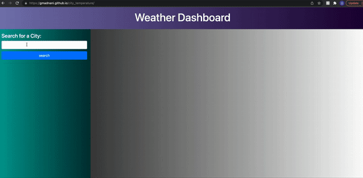
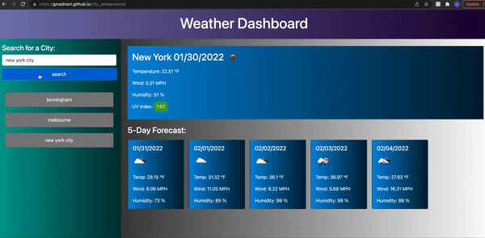

# city_temperature

## Table of Contents
- [Task](#task)
- [Website Description](#Website-description)
- [GIF](#gif)
- [Website](#website)

## Task
The purpose of this project is to create a website that fetches data from (https://openweathermap.org). It shows the detailed weather condition of the city. The api calls are done through ajax get method. The previously searched cities are local stored and are displayed and can be viewed again.

## Website Description 
City temperature displays a weather dashboard of any city in the world. The cities can be searched in the search box and can be viewed again from the search history section. The dashboard displays the city name, the date, an icon representation of weather conditions, the temperature, the humidity, the wind speed, and the UV index. The UV index has a background color based on how high is the UV index.

## GIF

  
  
Fig 1: searching for the cities

   

  
  
Fig 2: view the previously searched histories

   

## Website
https://gmadnani.github.io/city_temperature/

https://github.com/gmadnani/city_temperature

## License
[MIT](https://choosealicense.com/licenses/mit/)
